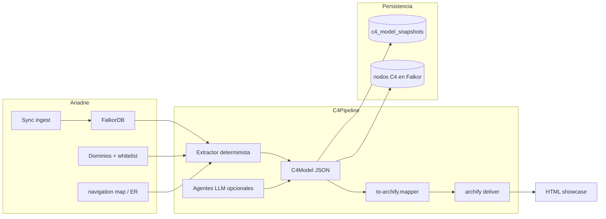

# Plan: C4 + Archify en Ariadne

Plan incremental para reintroducir diagramas **C4** en Ariadne combinando:

- **Ariadne** — fuente de verdad (FalkorDB, dominios, sync, MCP).
- **Patrón Litho / Terrain** — semántica C4 (niveles, fases, snapshots, narrativa opcional).
- **Archify** — presentación (HTML/SVG showcase, validación, delta, export).

No se integra el binario Rust de Litho ni se re-indexa el código en paralelo. Archify no genera C4 desde el repo: **Ariadne extrae → mapper → Archify renderiza**.

**Contexto histórico:** C4 existió en Ariadne (`feat(c4)`, commit `73106ac`) y se retiró en 1.4.0 (PlantUML/Kroki, solo System+Container desde compose). Se mantiene gobierno de dominios (`/domains`, `graph-routing`, `cypherShardContexts`). Ver `CHANGELOG.md` § Removed.

**Referencias externas:**

- [deepwiki-rs / Litho](https://github.com/sopaco/deepwiki-rs) — pipeline C4 y docs.
- [Terrain](https://github.com/sopaco/terrain) — evolución Litho (knowledge en `.terrain/`).
- [Archify](https://github.com/tt-a1i/archify) — renderer JSON IR → HTML.

---

## Principios

| Regla | Detalle |
| ----- | ------- |
| Grafo primero | Toda caja C4 debe tener `evidence[]` apuntando a Falkor, compose, dominio o navigation map. |
| LLM acotado | Solo narrativa L1 y descripciones; no inventar topología sin evidencia. |
| Mermaid secundario | Export opcional; el artefacto principal es HTML Archify. |
| Sin Kroki/PlantUML | No reintroducir proxy SVG externo. |
| Multi-shard | Consultas Cypher con `cypherShardContexts` (igual que dominios/MCP). |
| Configuración | **Ajustes → Sistema → C4 / Diagramas** (`system_settings`), sin variables de entorno. |

---

## Arquitectura objetivo



### Reparto de responsabilidades

| Capa | Responsable | Entregable |
| ---- | ----------- | ---------- |
| Datos | Ariadne ingest + Falkor | Nodos/rels de código e infra |
| Semántica C4 | `C4Model` + extractores | JSON con niveles L1–L4 |
| Narrativa | Orchestrator (opcional) | Descripciones, actores |
| Presentación | Archify CLI | `*.architecture.html` validado showcase |
| Consumo | UI + MCP + The Forge | URL, JSON, parity pack |

---

## Contrato intermedio: `C4Model` v1

Ubicación propuesta: `packages/ariadne-common/src/c4/`.

```typescript
type C4Level = 'context' | 'container' | 'component' | 'code';

interface C4Evidence {
  source: 'falkor' | 'compose' | 'domain' | 'navigation_map' | 'llm';
  nodeId?: string;
  filePath?: string;
  lineRange?: [number, number];
  reason: string;
}

interface C4Element {
  id: string;
  kind: 'person' | 'system' | 'container' | 'component' | 'external';
  name: string;
  technology?: string;
  description?: string;
  evidence: C4Evidence[];
}

interface C4Relationship {
  id: string;
  from: string;
  to: string;
  label?: string;
  protocol?: string; // REST, gRPC, eventos, etc.
  evidence: C4Evidence[];
}

interface C4Model {
  schemaVersion: '1.0';
  projectId: string;
  repoId?: string;
  level: C4Level;
  generatedAt: string;
  generator: 'sync' | 'llm' | 'hybrid';
  contentHash: string;
  elements: C4Element[];
  relationships: C4Relationship[];
}
```

### Postgres: `c4_model_snapshots`

| Columna | Tipo | Notas |
| ------- | ---- | ----- |
| `id` | uuid | PK |
| `project_id` | uuid | FK projects |
| `repo_id` | uuid | nullable, multi-root |
| `level` | enum | context \| container \| component \| code |
| `model_json` | jsonb | `C4Model` |
| `archify_html_path` | text | ruta o URL del HTML entregado |
| `content_hash` | text | hash del subgrafo fuente |
| `generator` | text | sync \| llm \| hybrid |
| `created_at` | timestamptz | |

---

## Mapeo C4 → Archify

Archify tipo `architecture` cubre bien **C4 Container** y parte de **Context**.

| C4 | Archify `architecture` |
| -- | ---------------------- |
| `container` + path `frontend/` | `type: frontend` |
| `container` + API/backend | `type: backend` |
| `database` | `type: database` |
| `external` / otro dominio | `type: external` |
| cola / broker | `type: messagebus` |
| límite de dominio | boundary / `engineering_profile: deployment-ownership` (solo si el usuario lo pide) |
| `COMMUNICATES_WITH` | relationship con label = protocolo |

Mapper: `packages/ariadne-common/src/c4/to-archify.mapper.ts`.

Comando de entrega (en ingest o job):

```bash
node bin/archify.mjs deliver architecture <mapped>.json <output>.html --quality showcase --json
```

Validación previa:

```bash
node bin/archify.mjs validate architecture <mapped>.json --quality showcase --json
```

---

## Estructura de código (objetivo final)

```
packages/ariadne-common/src/c4/
  c4-model.types.ts
  from-falkor.extractor.ts
  to-archify.mapper.ts

services/ingest/src/c4/
  c4-infrastructure.ts          # revive lógica compose (git 73106ac)
  c4-sync.producer.ts           # MERGE :C4System / :C4Container en Falkor
  c4-snapshot.service.ts
  c4-archify.renderer.ts        # subprocess archify deliver
  c4-generate.controller.ts
  README.md

services/orchestrator/src/c4/   # entrega 2+
  c4-context.agent.ts
  c4-boundary.agent.ts

services/api/src/c4/
  c4.controller.ts              # servir HTML estático

services/mcp-ariadne/
  get_c4_model
  generate_c4_diagram
  diff_c4_model                 # entrega 3+

frontend/src/pages/ProjectDetail/
  ArchitecturePanel.tsx         # tabs Dominios | Diagramas C4 | Historial
  C4DiagramViewer.tsx
  C4EvidencePanel.tsx
```

### Nodos Falkor (revive/ampliación)

```
(:C4System)
(:C4Container)
(:C4Component)
(:C4Person)                     # entrega 2

HAS_CONTAINER, CONTAINS_COMPONENT, COMMUNICATES_WITH, USES, DEPENDS_ON
IMPLEMENTS → (Component|File|Route|Controller)  # enlace al grafo existente
```

---

## APIs y MCP

### REST (ingest)

| Método | Ruta | Descripción |
| ------ | ---- | ----------- |
| `GET` | `/projects/:id/c4?level=container` | `C4Model` JSON |
| `POST` | `/projects/:id/c4/generate` | `{ levels?, useLlm?, repoId? }` |
| `GET` | `/projects/:id/c4/snapshots` | historial |
| `GET` | `/projects/:id/c4/diff?from=&to=` | diff entre snapshots |
| `GET` | `/projects/:id/c4/html?level=container` | HTML Archify |

### MCP

| Tool | Descripción |
| ---- | ----------- |
| `get_c4_model` | JSON por nivel |
| `generate_c4_diagram` | regenera + devuelve URL HTML |
| `diff_c4_model` | compare Archify / receipt (entrega 3+) |

### Ajustes del sistema (`system_settings.c4_*`)

| Campo UI | Propósito |
| -------- | --------- |
| `c4Enabled` | MERGE C4 en sync + grafo Falkor |
| `c4AutoOnFullSync` | Snapshot + HTML tras full sync |
| `c4ArchifyBin` | Ruta CLI Archify (opcional; autodetect en Docker) |

---

## UI — pestaña Arquitectura

```
[ Dominios ]  [ Diagramas C4 ]  [ Historial ]
```

- **Diagramas C4:** tabs Context | Container | Component.
- **Viewer:** iframe o nueva pestaña con HTML Archify (no Kroki, no React Flow C4).
- **Panel evidencias:** `filePath`, `nodeId` → enlace al explorador de grafo.
- **Acciones:** Regenerar, Comparar snapshot, Exportar MD (entrega 4).
- **Drill-down:** nodo Container → diagrama Component; nodo Component → `ComponentGraph` / Legacy Impact.

---

## Entregas

Estado: **planificado**. Actualizar checkboxes al completar cada ítem.

---

### Entrega 1 — Container showcase (MVP)

**Objetivo:** diagrama C4 Container del propio monorepo Ariadne, determinista, HTML Archify en UI. Sin LLM.

**Duración estimada:** 2–3 semanas.

#### 1.1 Tipos y contrato

- [x] `packages/ariadne-common/src/c4/c4-model.types.ts` (+ tipos TS; Zod pendiente)
- [x] Tests unitarios (`to-archify.mapper.spec.ts`, `c4-infrastructure.spec.ts`)
- [x] Documentar contrato en este archivo (§ Contrato intermedio)

#### 1.2 Extracción determinista

- [x] Revivir/adaptar `c4-infrastructure.ts` desde commit `73106ac`
- [x] Parse `docker-compose.yml` → containers + `depends_on` → relaciones
- [x] Workspaces monorepo (`services/*`) → pathPrefixes
- [x] `c4-ingest.service.ts`: MERGE nodos en Falkor post-sync (flag en Ajustes → Sistema)
- [x] Vitest con fixture `docker-compose`

#### 1.3 Mapper Archify

- [x] `to-archify.mapper.ts`: `C4Model` → `*.architecture.json` (layout grid)
- [x] Añadir Archify al Dockerfile ingest (`/opt/archify`; sin env `ARCHIFY_BIN`, autodetect + override en Ajustes → Sistema)
- [x] `c4-archify.renderer.ts`: `validate` + `deliver` subprocess
- [x] Spike: IR pasa `archify validate --quality showcase` (local)

#### 1.4 Persistencia

- [x] Migración `c4_model_snapshots`
- [x] `c4-snapshot.service.ts` (guardar modelo + path HTML + contentHash)

#### 1.5 API

- [x] `GET /projects/:id/c4?level=container`
- [x] `POST /projects/:id/c4/generate` (solo container, sin LLM)
- [x] `GET /projects/:id/c4/html?level=container`

#### 1.6 Frontend

- [x] Tab **Diagramas C4** en `ArchitecturePanel.tsx`
- [x] `C4DiagramViewer.tsx` (iframe `srcDoc`)
- [x] Estado vacío / error / regenerando

#### 1.7 MCP

- [x] `get_c4_model` (level=container)
- [x] Actualizar `services/mcp-ariadne/README.md` y `docs_mcp/`

#### 1.8 Criterios de aceptación

- [ ] Tras sync de Ariadne: api, ingest, frontend, orchestrator, mcp-ariadne, postgres, falkor, redis visibles en diagrama
- [ ] `archify validate --quality showcase` → 0 errores, 0 warnings
- [ ] Cada elemento con ≥1 `evidence`
- [x] Flags en Ajustes → Sistema (sin env)

---

### Entrega 2 — Context + dominios

**Objetivo:** nivel C4 Context usando gobierno de dominios existente; narrativa opcional.

**Duración estimada:** ~2 semanas.

#### 2.1 Extracción Context

- [x] `Project.domainId` → sistema principal
- [x] `ProjectDomainDependency` → sistemas `external` + labels (`connectionType`)
- [x] `DomainDomainVisibility` → relaciones entre dominios
- [x] Multi-root: un `C4System` por repo / root

#### 2.2 Mapper Archify Context

- [x] Nodos `external` + sistema central
- [ ] Evaluar `deployment-ownership` solo bajo petición explícita

#### 2.3 LLM opcional (ingest)

- [x] `c4-context.enricher.ts`: actores `person`, descripciones
- [x] Input: README, dominios, whitelist — **no** re-scan del código
- [x] `generator: hybrid`; evidencia `llm` marcada en UI

#### 2.4 UI + API

- [x] Tab Context en diagramas
- [x] `POST /c4/generate` acepta `levels: ['context','container']`
- [x] Badge `deterministic` vs `llm-assisted` por elemento

#### 2.5 Criterios de aceptación

- [x] Proyecto con dominio + whitelist muestra sistemas externos correctos
- [x] `cypherShardContexts` respetado en extracción multi-shard

---

### Entrega 3 — Component + delta

**Objetivo:** agrupar componentes por container desde Falkor; comparar versiones.

**Duración estimada:** ~3 semanas.

#### 3.1 Extracción Component

- [x] Cluster por `pathPrefix` del container
- [x] Subgrafo `IMPORTS` / `CALLS` / `RENDERS` acotado
- [x] `IMPLEMENTS` → nodos `Component` / `File` del grafo
- [x] Rutas web vía nodos `Route` en Falkor (paridad navigation map)

#### 3.2 Secuencias (opcional en esta entrega)

- [x] Flujo API representativo → Archify `sequence` desde OpenAPI/CALLS

#### 3.3 Delta / PR

- [x] `contentHash` del subgrafo por nivel
- [x] `archify compare` entre snapshots → HTML delta
- [x] `GET /projects/:id/c4/diff?from=&to=`
- [x] MCP `diff_c4_model`
- [x] Integración con `detect_changes` (alerta si cambia topología)

#### 3.4 UI

- [x] Tab Component
- [x] `C4EvidencePanel.tsx` → explorador grafo
- [x] Historial de snapshots + vista compare

#### 3.5 Criterios de aceptación

- [x] Drill-down Container → Component funcional
- [x] Diff entre dos syncs muestra containers añadidos/eliminados

---

### Entrega 4 — Ecosistema

**Objetivo:** export documental, chat, The Forge, nivel Code ligero.

**Duración estimada:** ~2 semanas.

#### 4.1 Export estilo Litho (desde C4Model, no archivos sueltos en repo)

- [x] Generar 6 markdowns (Overview, Architecture, …) desde snapshots
- [x] Export ZIP o descarga desde UI (bundle `.md` unificado)
- [ ] Opcional: escribir en `.ariadne/c4/` del clone (no commit por defecto)

#### 4.2 Chat

- [x] Intent `architecture_diagram` en router de chat
- [x] Chip en `ChatPromptChips.tsx`
- [x] Respuesta con enlace al HTML + resumen

#### 4.3 The Forge / brownfield

- [x] `c4ContainerHtmlUrl`, `c4ModelJson` en parity pack
- [x] Documentar en `docs/contracts/brownfield-parity-pack-v1.md`

#### 4.4 Nivel Code

- [x] No diagrama Archify denso: enlace a `get_component_graph` / explorador
- [x] Opcional: `sequence` para un endpoint concreto

#### 4.5 Operación

- [x] C4 auto-sync documentado en `CONFIGURACION_Y_USO.md`
- [x] Métricas: tiempo generate, tasa validate showcase (logs ingest)
- [x] `CHANGELOG.md` entrada C4

---

## Qué no hacer

| Evitar | Motivo |
| ------ | ------ |
| Integrar binario `deepwiki-rs` / `terrain` como dependencia runtime | Duplica ingest |
| PlantUML / Kroki | Ya falló en producción |
| LLM generando cajas sin evidencia | Pierde trazabilidad SDD |
| React Flow solo para C4 | Se retiró; Archify cubre presentación |
| Commitear HTML generado en el repo del cliente por defecto | Artefacto de plataforma o export opcional |

---

## Spike inicial (antes de Entrega 1 completa)

Script o comando manual para validar el camino feliz:

1. Leer `docker-compose.yml` del monorepo Ariadne.
2. Construir `C4Model` mínimo a mano o con extractor stub.
3. `to-archify.mapper` → `tmp/ariadne-container.architecture.json`.
4. `node bin/archify.mjs deliver architecture tmp/... tmp/ariadne-c4.html --quality showcase`.
5. Abrir HTML en navegador; verificar showcase pass.

Si el spike falla en validate, corregir mapper antes de cablear sync/API.

---

## Seguimiento

| Entrega | Estado | Fecha inicio | Fecha cierre | Notas |
| ------- | ------ | ------------ | ------------ | ----- |
| 1 — Container | en progreso | 2026-09-11 | | MVP código + UI + MCP; falta deploy Archify en Docker |
| 2 — Context | completado | 2026-09-11 | 2026-09-11 | Dominios + LLM opcional en ingest |
| 3 — Component + delta | completado | 2026-09-11 | 2026-09-11 | Falkor + diff + UI compare + sequence |
| 4 — Ecosistema | completado | 2026-09-11 | 2026-09-11 | Export MD, chat, parity pack |

Actualizar esta tabla al cerrar cada entrega.

---

## Referencias internas

- `CHANGELOG.md` — retiro C4 1.4.0
- `frontend/src/pages/ProjectDetail/ArchitecturePanel.tsx` — UI dominios actual
- `services/ingest/src/domains/` — gobierno de dominios
- `services/ingest/src/projects/projects.service.ts` — `getGraphRouting`, `cypherShardContexts`
- `services/mcp-ariadne/src/navigation-map-scanner.ts` — navigation map
- `services/ingest/src/chat/er-diagram-mermaid.util.ts` — patrón diagrama desde grafo
- `frontend/src/components/MermaidZoomViewport.tsx` — zoom Mermaid (ER; C4 usa Archify)
- Git `73106ac` — implementación C4 original (`c4-infrastructure.ts`, `getC4Model`)
